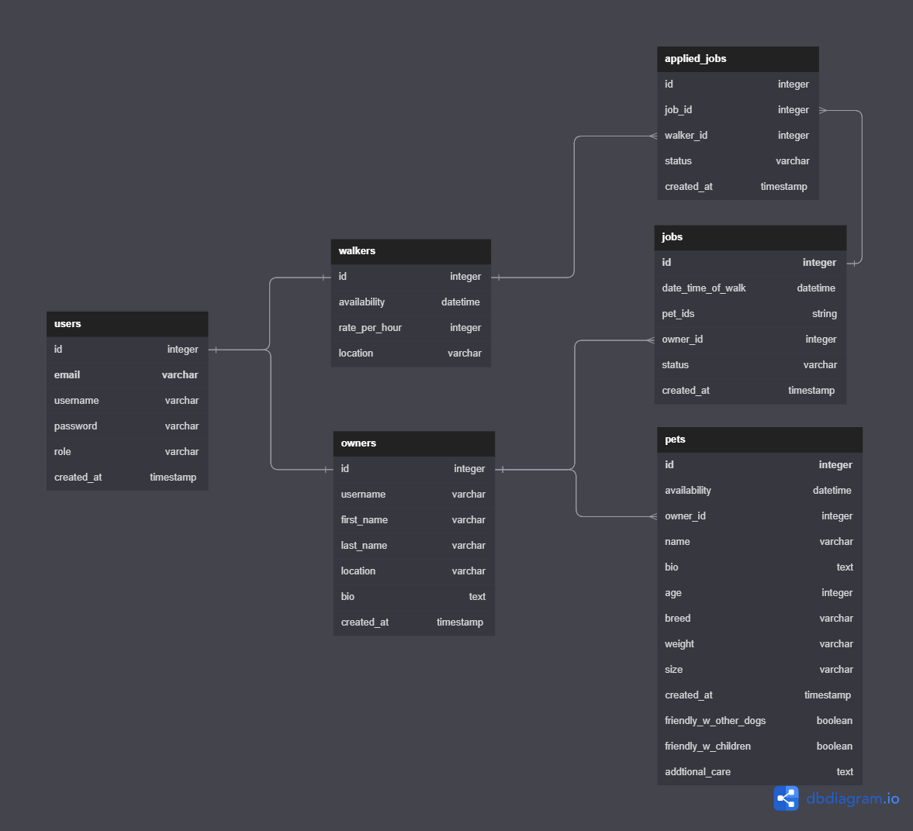

# Capstone 2 Proposal: Pet Walking App

For this project I will be creating a web application to find pet walkers based on the pet owner’s location . The app will also allow users to sign up to be a walker and set their own rate and availability. The demographic that is targeted for this app will be pet owners who do not have time to walk their pets and pet  walkers looking to make money walking other people’s pets. The tech stack that will be used for this project will be React, Node, Postgresql, Jest and React Test Library (for testing). 

The project will focus evenly on both the frontend and backend. This app will be a website. The main functionality that the app will include from the pet owner side is being able to search for pet walkers and booking an appointment with them. From the pet walker side we want to allow them to set their rate, availability and location so that they will show up on the pet walker’s search result. Sensitive information on this app will most likely only be the password to login. Payment information would also be sensitive information on this app but that is not within scope of this project. I will have to create my own API for this project. I will also need to create fake data to seed so that we can have data to work with. 

## Below is an example of what the database may look like

